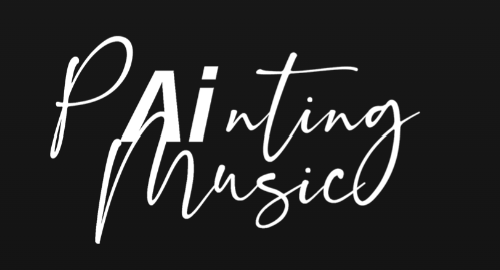

# Painting Music



## Description

Painting Music is a project that looks to use explainable AI that converts the process of painting a picture into music.

## Current Applications

Using Painting Music technology, two different applications have been developed:

- Canvas Capture
- Sketchpad

These applications and their respective documentation can be found in the application directory.

## Contributing

### Cloning

You are able to clone the full repository by any means.  We personally recommend using the following command:

```bash
git clone 'url'
```

### Trunk-Based Development

We follow Trunk-Based Development (TBD) to ensure continuous integration and minimize the risk of large merge conflicts. In this approach:

1. Work directly on the `main` branch is avoided to maintain a stable codebase.
2. Developers are encouraged to create a new branch for each feature, bug fix, or task.
3. Once the task or feature is complete, a Pull Request (PR) should be opened to merge the branch back into main.

#### Workflow

1. Create a branch from main (use descriptive names for branches):

    ```bash
    git checkout -b feature/your-feature-name
    ```

2. Develop the feature or fix the issue on your branch.
3. Test your changes thoroughly.
4. Create a PR against main and provide a detailed description of your changes. Be sure to:
    - Include relevant information or context for reviewers.
    - Link to any related issues (if applicable).
5. The PR will be reviewed by a team member. Once approved, it will be merged into main.

#### Why Trunk-Based Development?

- Frequent integration: Developers integrate their changes frequently, which helps to identify issues earlier.
- Reduced merge conflicts: With smaller, more frequent changes, the likelihood of conflicts decreases.
- Improved code quality: Code reviews help ensure that the code meets the project's standards before merging.

### Commit Convention

Developing in Painting Music, it is asked that commits to the main branch follow conventional commits. See [here](https://gist.github.com/qoomon/5dfcdf8eec66a051ecd85625518cfd13) for further documentation on conventional commits.

#### Commit Examples and explanation

```powershell
feat(canvas-capture): add some work
refactor(sketchpad): change directory structure
fix(core): adjust parameters to resolve issue
docs(markov): add good commit convention section
chore(sketchpad): alter package description
```

Key thing to takeaway from the above examples is:

1. The key word at the start:
    1. feat -> This is when you are adding a new feature (or contributing towards a feature)
    2. refactor -> This is when you have changes the way code is written to improve scalability / readability etc
    3. fix -> When you have fixed a bug
    4. docs -> When you have added to the docs
    5. chore -> This is for work that has been added outwith the above categories
2. Name of the model.  This is essentially the model you are working e.g. Markov/Markov2/Mercury
3. Using imperative language and keeping commit messages short and consise (use words like add, change, alter, etc)
