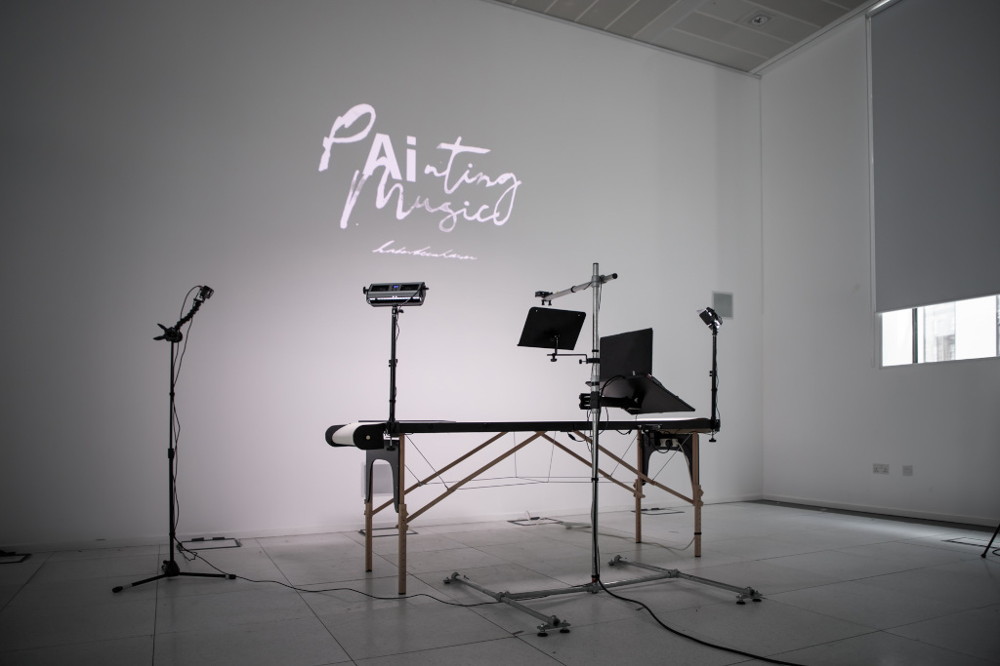

# Canvas Capture

## Description

Canvas Capture is a desktop application that is used by a resident artist, Kate Steenhauer, in order to add on the fly generated music to their live performances, based on what is being painted.

## Physical Set Up

Working with Ray Interactive, we designed a bespoke set up to allow Kate to work with Painting Music Technology.  This is comprised of a go-pro camera being positioned above the canvas, this is then hooked up to a steam deck which allows Kate to trigger images to be taken and sent to a directory where Canvas Capture has a watcher positioned to then begin the music generation process.

See image for physical set up:



## Developer Documentation

### Contributing

For working on Canvas Capture, it is suggested to open the [CanvasCapture.sln](CanvasCapture.sln) inside visual studio.

This solution is comprised of two projects:

- CanvasCapture
- CanvasCaptureUI

CanvasCapture is a simple class library that was used in the event we decide to change technology.  CanvasCaptureUI is the project which contains the windows desktop application code.

### Running Simulation Mode

As part of development, a simulation mode was implemented to allow quick testing of image analysis.  For this to work, you need to set the following environment varible to the **absolute path** to a directory containing test images (for example this repo has test images [here](./CanvasCaptureUI/Simulation/TestImages)):

```text
PaintingMusicCanvasCaptureSimImageDirectory
```

### Running Full Mode

In order to run the full mode, you need to set the following environment variable to the directory where images will be added to:

```text
PaintingMusicCanvasCaptureImageDirectory
```

**NB/** You may need to close and re-open visual studio for environment variables to be picked up.

You will next need to make sure PaintingMusic-MusicPlayer is running. Failure to run this before starting a performance, will result in the application failing.
